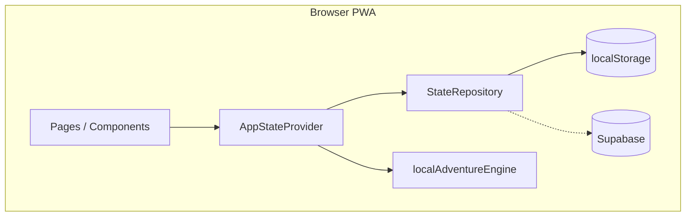

# Architecture

---

## Stack

| Layer | Technology |
|-------|------------|
| UI | React 19 + TypeScript |
| Routing | React Router 7 (`createBrowserRouter`) |
| Styling | Tailwind 4 + inline styles (Stitch pages) |
| Build | Vite 8 |
| State | React Context + localStorage / optional Supabase |
| Auth | Supabase Auth (optional) |
| Analytics | PostHog (optional) |
| Errors | Sentry (optional) |
| E2E | Playwright |

---

## High-level diagram

---

## Boundaries

| Concern | Location | Notes |
|---------|----------|-------|
| Mission generation | `src/data/localAdventureEngine.ts` | No server required |
| Pure state transitions | `src/lib/pawstreakState.ts` | Testable functions |
| Persistence | `src/lib/*StateRepository.ts` | Swappable |
| Session | `src/hooks/useSession.tsx` | Supabase session |
| Routes | `src/lib/router.tsx` | Single router export |

---

## Entry point

`src/main.tsx` → `AppStateProvider` → `RouterProvider`

Initializes: Sentry, PostHog, PWA install listeners (all no-op without env keys).

---

## Key design choices

1. **Demo-first** — app fully works without Supabase.
2. **Fat client** — emotional logic stays in TS modules, not SQL.
3. **Phone viewport** — 390px column, not responsive admin layout.
4. **Privacy by default** — analytics/monitoring scrub PII (`analytics.ts`, `errorMonitoring.ts`).

---

## Related

- [repo-structure.md](./repo-structure.md)
- [state-management.md](./state-management.md)
- [supabase-architecture.md](./supabase-architecture.md)
