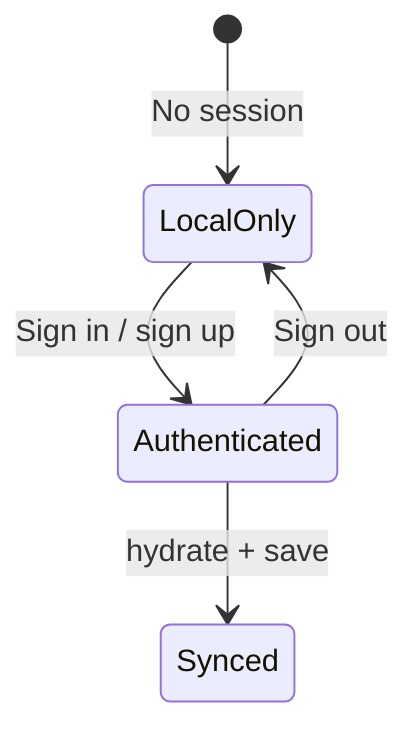

# Auth Flow

---

## Purpose

Auth is **progress protection**, not the core loop. Owners can complete walks without an account.

---

## Components

| Component | Role |
|-----------|------|
| `AccountStatusChip` | Header chip → Profile; `data-state`: local / synced |
| `SaveProgressNudge` | Dismissible banner on Today |
| `PostAdventureSavePrompt` | After first completion |
| `AccountPage` | Email/password + magic link |

Paths: `src/components/auth/*`, `src/pages/AccountPage.tsx`

---

## Methods (when Supabase configured)

| Method | testid |
|--------|--------|
| Email + password | `account-email-input`, `account-password-submit` |
| Magic link | `account-magic-link` |

Implementation: `src/lib/auth.ts`

---

## States

---

## Onboarding Google button

`onboarding-google-button` — shows **coming soon** note; does not block onboarding.

---

## Privacy

Do not send dog name or ZIP to analytics on auth events — see `src/lib/analytics.ts` contract.

---

## TODO

- [ ] Account merge when signing in mid-demo (document conflict UX)
- [ ] OAuth providers beyond Google stub

---

## Related

- [supabase-architecture.md](./supabase-architecture.md)
