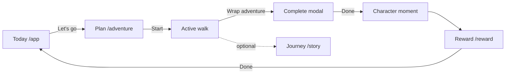

# Core Loop

> The only loop that must be flawless at launch.

---

## Diagram

---

## Step-by-step (implementation)

| Step | Route | Key file | State touchpoints |
|------|-------|----------|-------------------|
| 1. See today's mission | `/app` | `src/pages/DashboardPage.tsx` | `generatedMission`, `dogMood` |
| 2. Nudge vibe (optional) | `/app` | chips → `selectVibe()` | `src/lib/pawstreakState.ts` |
| 3. Open plan | `/adventure` | `src/pages/AdventurePage.tsx` | `planMode === true` |
| 4. Start walk | `/adventure` | place card **Start** | `setPlanMode(false)` |
| 5. Capture memory | active view | `adventure-memory-input` | local textarea |
| 6. Complete | active view | Wrap adventure | `completeAdventure()` |
| 7. Celebrate | `/character-moment` → `/reward` | `CharacterMomentPage`, `RewardPage` | `recentAdventures` append |
| 8. Remember | `/story` | `StoryPage.tsx` | `MemoryDetailSheet` |

---

## Onboarding (pre-loop)

Route: `/` → `src/pages/OnboardingPage.tsx`

Collects: dog name, personality, energy, goals, ZIP → seeds locale and mission pools via `completeOnboarding()`.

E2E reference: `tests/e2e/pawstreak.spec.ts` → `completeOnboarding()`.

---

## Auth overlay (parallel, not blocking)

- `AccountStatusChip`, `SaveProgressNudge`, `PostAdventureSavePrompt`
- Components: `src/components/auth/*`
- Does not block first walk

---

## Testids (regression anchors)

| Moment | testid |
|--------|--------|
| Start from Today | `dashboard-start-adventure-cta` |
| Active header | `adventure-send-off` |
| Complete | `adventure-complete-modal` |
| Reward headline | `reward-headline` |

Full list: [testing.md](../engineering/testing.md).

---

## Related

- [emotional-design-principles.md](./emotional-design-principles.md)
- [systems/recommendation-system.md](../systems/recommendation-system.md)
- [systems/memory-system.md](../systems/memory-system.md)
