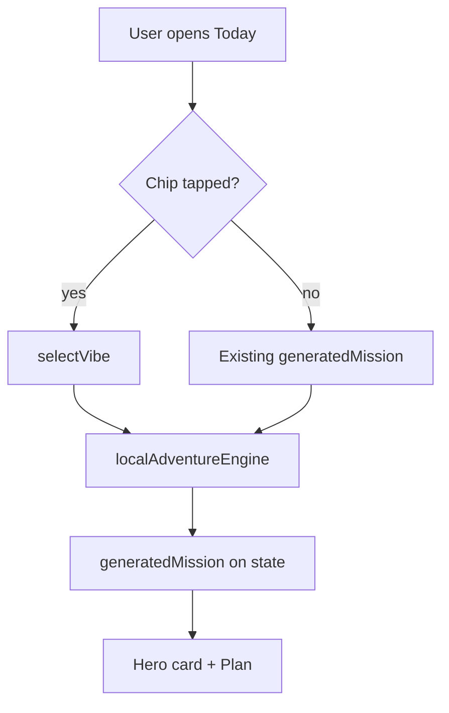

# Recommendation System

> Local, deterministic mission recommendations — no ML server at launch.

---

## Flow

---

## Key functions

| Function | File |
|----------|------|
| `selectVibe(state, vibe)` | `pawstreakState.ts` |
| `rollPickForMe` | `pawstreakState.ts` |
| `missionFromQuickPick` | `localAdventureEngine.ts` |
| `quickAdventurePicksForZip` | `localAdventureEngine.ts` |

---

## Vibe archetypes (hidden mechanics)

| UI chip | `VibeArchetype` |
|---------|-----------------|
| Social | `pulse` |
| Trail | `wander` |
| Chill | `salt` |
| Wild | `wild` |

`DashboardPage.tsx` → `VIBE_CHIPS` → `handleChipClick` → `selectVibe()`

**E2E:** `category chip updates today recommendation` asserts `dashboard-gm-title` changes.

---

## Mission card fields (UI)

| Field | Today hero |
|-------|------------|
| `title` | `dashboard-gm-title` |
| `locationHint` | subtitle |
| `description` | body |
| `emoji` / image | vibe imagery |

---

## Plan spots

Plan mode shows **place cards** — local static lists filtered by category, not Google Places API.

> **TODO:** Document place list source file(s) in `AdventurePage.tsx` or `data/`.

---

## Anti-patterns

- Do not add server round-trip for daily mission at launch
- Do not show park/beach taxonomies as primary labels

---

## Related

- [localization-system.md](./localization-system.md)
- [discovery-system.md](./discovery-system.md)
